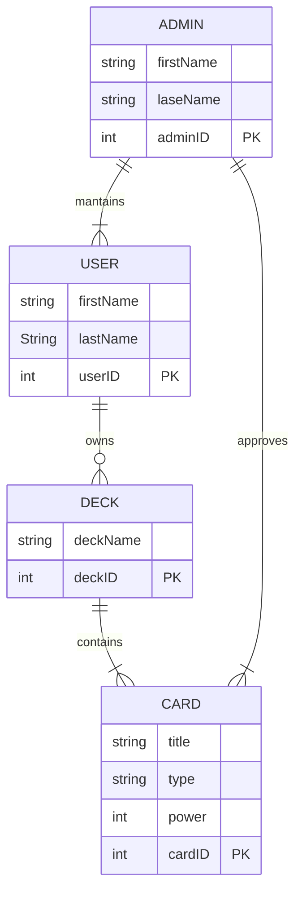
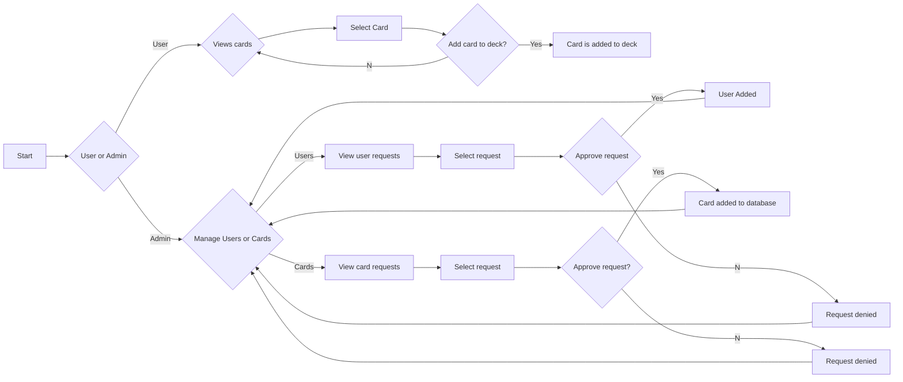
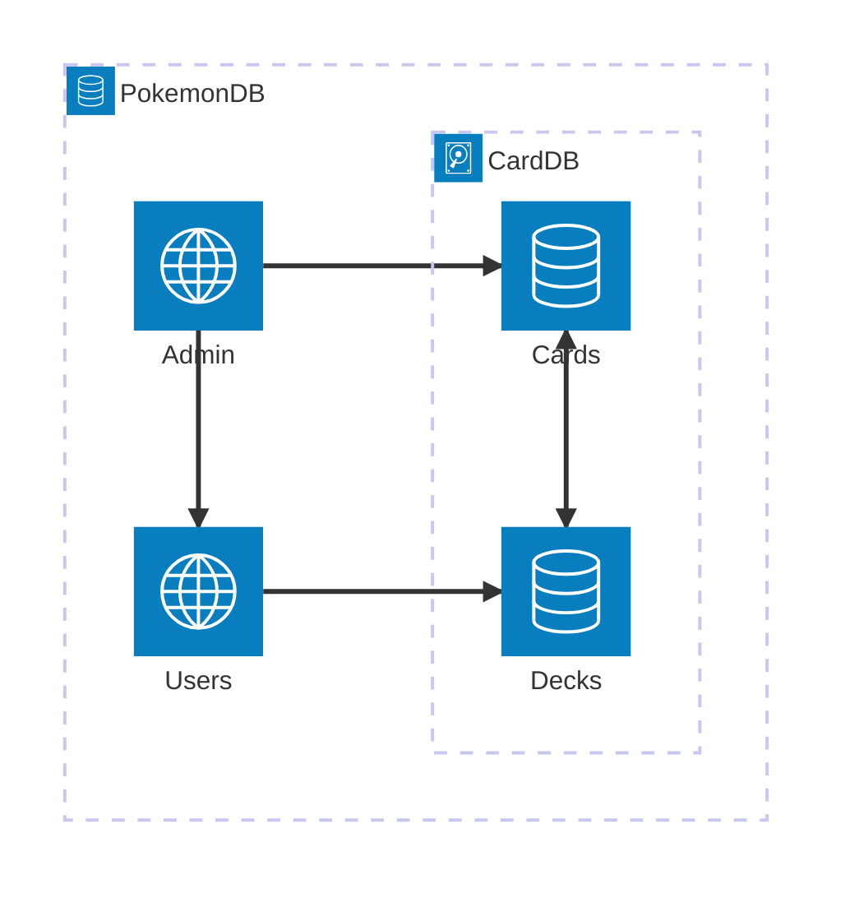
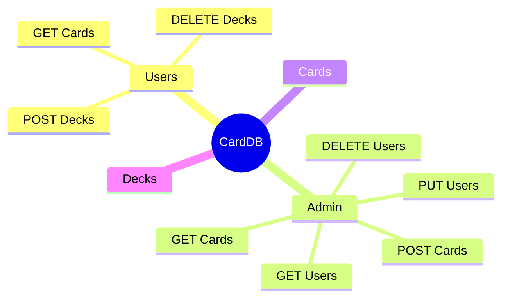

# Pokemon Card Storage Web App (working title)

## Pokemon App E-R Diagram

```mermaid

%%ER Diagram for pokemon app
erDiagram
  USER ||--o{ DECK : owns
    USER{
      string firstName
      String lastName
      int userID PK      
    }
  CARD
    CARD{
      string title
      string type
      int power
      int cardID PK
    }
  DECK ||--|{ CARD : contains
    DECK{
      string deckName
      int deckID PK      
    }
  ADMIN ||--|{ CARD : approves
  ADMIN ||--|{ USER : mantains
    ADMIN{
      string firstName
      string laseName
      int adminID PK
    } 

```
 

## Pokemon App Flowchart

```mermaid
flowchart LR
  
  A["Start"]-->B{"User or Admin"}
  B--User-->C{"Views cards"}-->D["Select Card"]-->E{"Add card to deck?"}
  E--Yes-->F["Card is added to deck"]
  E--No-->C
  B--Admin-->G{"Manage Users or Cards"}
  G--Users-->H["View user requests"]-->I["Select request"]-->J{"Approve request"}
  J--Yes-->K["User Added"]-->G
  J--No-->L["Request denied"]-->G
  G--Cards-->M["View card requests"]-->N["Select request"]-->O{"Approve request?"}
  O--Yes-->P["Card added to database"]-->G
  O--No-->Q["Request denied"]-->G
  
```

## Pokemon App Architecture Diagram

```mermaid

architecture-beta
  
  group pokemonDB(database)[PokemonDB]

  group cardDB(disk)[CardDB] in pokemonDB

  service users(internet)[Users] in pokemonDB
  service decks(database)[Decks] in cardDB
  service admin(internet)[Admin] in pokemonDB
  service cards(database)[Cards] in cardDB


  users:R --> L:decks
  admin:R --> L:cards
  admin:B --> T:users
  decks:T <--> B:cards

  

```

## Pokemon App Endpoint Disgram

```mermaid
---
title: Pokemon App Mindmap
---

  mindmap
    root((CardDB))
      Users
        GET Cards
        POST Decks
        DELETE Decks        
      Admin
        GET Users
        PUT Users
        DELETE Users
        GET Cards
        POST Cards        
      Cards
      Decks
     
        
```

