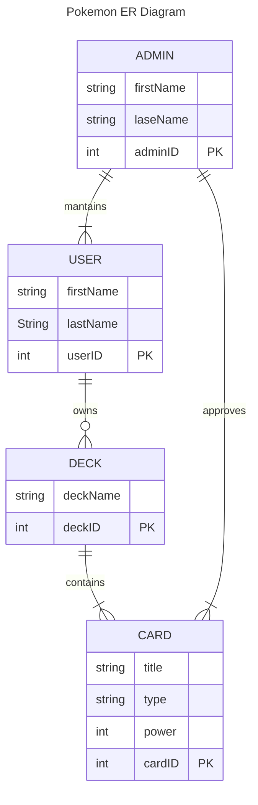

# Pokemon Card Storage Web App (working title)


```mermaid
---
title: Pokemon ER Diagram
---

%%ER Diagram for pokemon app
erDiagram
  USER ||--o{ DECK : owns
    USER{
      string firstName
      String lastName
      int userID PK      
    }
  CARD
    CARD{
      string title
      string type
      int power
      int cardID PK
    }
  DECK ||--|{ CARD : contains
    DECK{
      string deckName
      int deckID PK      
    }
  ADMIN ||--|{ CARD : approves
  ADMIN ||--|{ USER : mantains
    ADMIN{
      string firstName
      string laseName
      int adminID PK
    }

  

```

```mermaid

```

